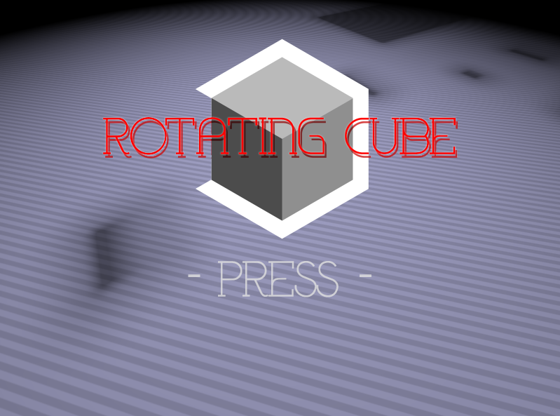

# RotatingCube
基于FunCode的一个游戏。

（虽然只用到了FunCode建的窗口）

## 屏幕截图

## 游戏说明

在本游戏中，共有6个不同的谜题。  
对于每个谜题，你需要旋转谜题方块直到方块和屏幕上的阴影重叠为止。  

你可以使用鼠标来旋转方块，或者使用键盘上的方向键来旋转方块。  

## 关于
山东软件大赛 FunCode组 参赛作品  
指导老师：于静  
制作人：许超 郑家鹏  

## 构建
在VS开发人员命令行中运行release.cmd即可完成所有构建工作，并生成release包。
